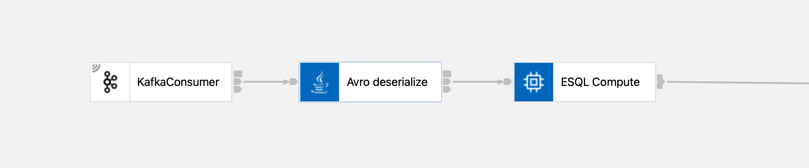
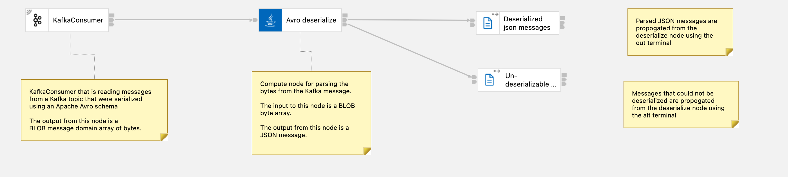

# IBM App Connect Enterprise Compute node for parsing Apache Avro data

- [Overview](#overview)
- [Contents](#contents)
- [Details](#details)
- [Dependencies](#dependencies)

## Overview

Sample compute node implementation for processing Kafka messages that have been serialized using Apache Avro schemas from a schema registry.

It turns json-encoded or binary-encoded data into a JSON object that can be processed using standard native App Connect transformation nodes.

## Contents

- [`AvroDeserialize.java`](./AvroDeserialize.java)
    - implementation of the Java compute node
- [`sample-policy.policyxml`](./sample-policy.policyxml)
    - example of a policy needed to configure the compute node with details of the schema registry to use

## Details

| **input terminal** | **format** | **details**                                                |
| ------------------ | ---------- | ---------------------------------------------------------- |
| input              | BLOB       | serialized message data retrieved by a KafkaConsumer node  |

| **output terminal** | **format** | **details**                                               |
| ------------------- | ---------- | --------------------------------------------------------- |
| out                 | JSON       | JSON object deserialized using an Apache Avro schema      |
| alt                 | BLOB       | messages that could not be deserialized*                  |

### Possible reasons for messages not being de-serializable:
- Schema has been deleted from the Schema Registry since the message was produced to the Kafka topic
- Schema Registry is not currently available
- Invalid schema registry credentials provided in the [config policy](#configuration)

## Dependencies

### Configuration

The compute node has a run-time dependency on a policy for providing the configuration information about the Avro schema registry to use.

A [sample policy is provided](./sample-policy.policyxml) and needs to be deployed with any message flows using this compute node.

### Jars

The compute node implementation has compile and run-time dependencies on the following jars. See the IBM App Connect Enterprise documentation on [Adding Java code dependencies](https://www.ibm.com/docs/en/app-connect/12.0?topic=java-adding-code-dependencies) for guidance on how to do this.

- [`avro-1.10.2.jar`](https://dlcdn.apache.org/avro/avro-1.10.2/java/avro-1.10.2.jar)
- `slf4j-api-1.7.25.jar`

### Schema Registry

The compute node implementation is based on schemas from an [Apicurio Schema Registry](https://www.apicur.io/registry/), such as the registry that is included with [IBM Event Streams](https://ibm.github.io/event-streams/) or run as [a stand-alone open source registry](https://www.apicur.io/registry/docs/apicurio-registry/2.1.0.Final/index.html).

It can be simply modified to support the use of other schema registries - comments in the [Java compute node code](./AvroDeserialize.java) identify where these changes are needed.

## Background

https://dalelane.co.uk/blog/?p=4518
